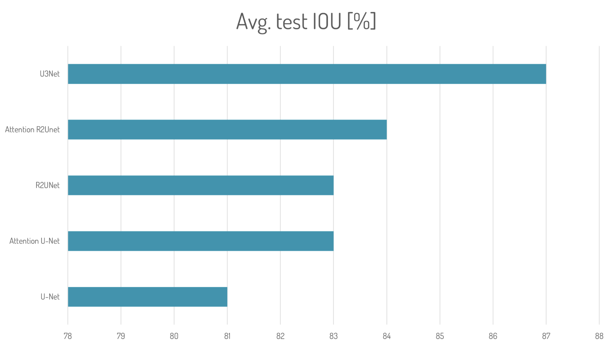

# Brain-MRI-Segmentation(2D Segmentation) Using Pytorch

This project aims to investigate and compare the performance of various deep learning architectures for brain image segmentation on 2D MRIs. The segmentation task involves identifying and labeling different regions of the brain which are of interest.

In particular,the dataset used in this project contains brain MRI images with manual FLAIR abnormality segmentation masks. The images were obtained from The Cancer Imaging Archive (TCIA) and correspond to 110 patients included in The Cancer Genome Atlas (TCGA) lower-grade glioma collection. The dataset also includes genomic cluster data, as reported in the studies by Mateusz Buda et al. (2019) and Maciej A. Mazurowski et al. (2017).

Our experiments involved training and evaluating several popular deep learning architectures, including U-Net, Attention U-Net, R2U-Net, Attention R2U-Net, and U-Net 3+, on this dataset. We compared the segmentation performance of each architecture using various metrics, such as Dice similarity coefficient (DSC), intersection over union (IoU), and accuracy. We also conducted a qualitative analysis of the segmentation results using visualization techniques to assess the quality of the segmentations.

The Jupyter notebook for all the architectures are available in this repository, along with the results obtained from our experiments.You can find more information regarding the project on the presentation available in this repo.

Here is a comparative chart for results obtained on test set when trained for 50 epochs

Now when we extend the training to 100 epochs we can see the results improving. We did for for only two architectures due to computational requirments, anyone is encouraged to try for other architectures too.

